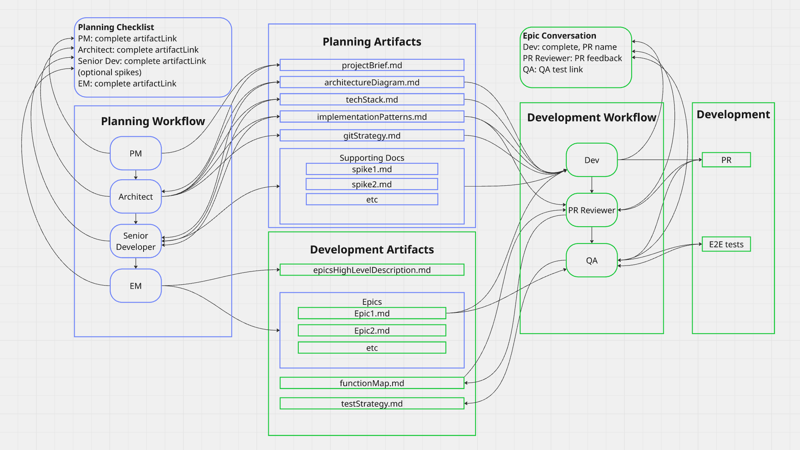

# Software Development Agent Ecosystem

A multi-agent system designed to streamline software development through collaborative AI agents across planning and development phases.

## Overview

This project implements an agent ecosystem that coordinates specialized AI agents to deliver software projects through planning to deployment. The system uses XML-based agent definitions and follows a structured workflow approach.

## Workflow & Artifact Diagram



The diagram above illustrates the complete agent workflow and artifact creation process:

- **Planning Workflow** (Left): Linear flow from PM → Architect → Senior Dev → EM
- **Planning Artifacts** (Center): Documents created during planning phase
- **Development Artifacts** (Center): Documents and outputs from development phase  
- **Development Workflow** (Right): Parallel execution flow for each epic
- **Epic Conversations** (Top Right): Tracking completion status per epic

Each agent creates specific artifacts that serve as inputs for subsequent agents, ensuring proper information flow and dependency management throughout the development lifecycle.

## Getting Started
For Cursor see .cursor/mcp.json.  Cursor will recognize this and register the agents as tools, no extra setup is required, simply accept at the bottom when Cursor prompts to register the MCP. Any other IDE extend the mcp.json tool definitions (maybe will update to generic solution in the future)

The workflows have strong dependencies and are best used as: 

Planning Flow.

PM > Architect > Senior Dev > EM . This flow produces the artifacts that the Development flow will need

Development Flow

Dev > PR Reviewer > QA

### Agent Organization

The system is organized into two primary workflow phases:

#### Planning Phase Agents (`.agents/planning/`)
- **PM (Product Manager)** - Requirements and roadmap planning
- **Architect** - System architecture and technical design
- **Spike** - Research and proof-of-concept development
- **EM (Engineering Manager)** - Team coordination and oversight

#### Development Phase Agents (`.agents/development/`)
- **Git Handler** - Version control management (this is optional)
- **Developer** - Code implementation and development
- **Code Reviewer** - Code quality assurance
- **QA (Quality Assurance)** - Testing and validation

### Meta-Agent System

- **Agent Generator** (`.agents/agent_generator.md`) - Meta-agent for creating and managing other agents
- **Agent Template** (`.agents/agent_template.md`) - Standardized template for agent definitions

## Project Structure

```
.
├── .agents/                   # Agent definitions and templates
│   ├── agent_generator.md     # Meta-agent for creating agents
│   ├── agent_template.md      # Standardized agent template
│   ├── planning/              # Planning phase agents
        ├── pm.md              # Project manager
        ├── architect.md       # Architect
        ├── senior-dev.md      # Senior Developer
        └── em.md              # Engineering Manager                                 
│   └── development/           # Development phase agents
        ├── git-handler.md     # GitHub opperations (this agent is optional and not necesarily part of the workflow)
        ├── developer.md       # Developer
        ├── pr-reviewer.md     # Pull Request reviewer
        └── qa.md              # Quality Assurance Engineer                                
└── docs/                      # Documentation (artifacts go here)
```

### Prerequisites

#### GitHub CLI (Strongly Recommended)
The agent ecosystem heavily utilizes GitHub CLI (`gh`) for version control operations, pull request management, and repository coordination. While not strictly required, it's strongly recommended for optimal functionality.

## License

[Add your license information here]

## Support

For questions about the agent ecosystem:
- Review the `agent_generator.md` for creation guidelines
- Check `agent_template.md` for structural requirements
- Refer to individual agent documentation for specific capabilities
- For GitHub CLI issues, see the Prerequisites section or visit [GitHub CLI Documentation](https://cli.github.com/manual/)

---

*This project represents a cutting-edge approach to AI-assisted software development through structured agent collaboration.*